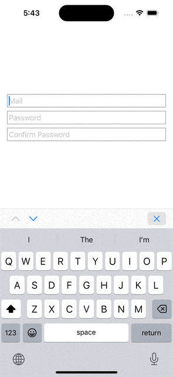

# KeyboardActions

KeyboardActions is a SwiftUI package that allows you to manage the focus of the keyboard in your app. Adds toolbar item above keyboard to easily switch focus between textfields or close keyboard

You can create an enumeration that represents your fields in a form. Confirm `FieldContract` which is basically a `Hashable` protocol currently

And add `.keyboardActions` modifier to your view to enable the toolbar above the keyboard

```swift
import KeyboardActions
import SwiftUI

struct ContentView: View {
    @State private var mail: String = ""
    @State private var password: String = ""
    @State private var confirmPassword: String = ""

    enum Field: CaseIterable, FieldContract {
    case mail
    case password
    case confirmPassword
    }

    @FocusState var focusedField: Field?

    var body: some View {
        VStack {
            TextField("Mail", text: $mail)
                .focused($focusedField, equals: Field.mail)
                .padding(4)
                .border(.gray)

            TextField("Password", text: $password)
                .focused($focusedField, equals: Field.password)
                .padding(4)
                .border(.gray)

            TextField("Confirm Password", text: $confirmPassword)
                .focused($focusedField, equals: Field.confirmPassword)
                .padding(4)
                .border(.gray)
        }
        .padding()
        .keyboardActions(focusedField: $focusedField, fields: Field.allCases)
        .onAppear {
            focusedField = Field.mail
        }
    }
}
```


